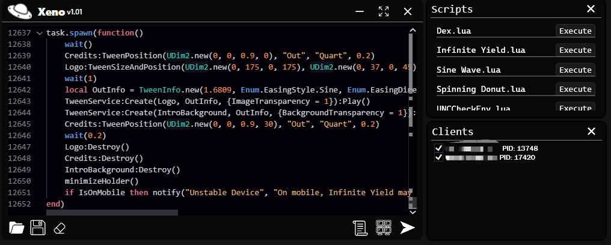
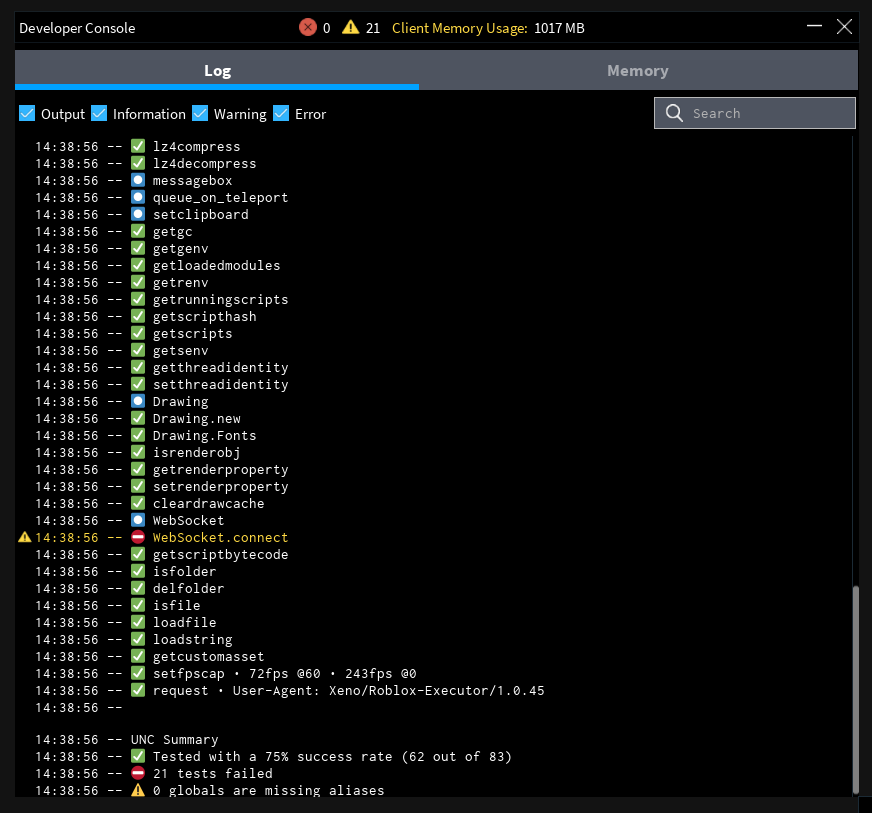

> [!WARNING]
> You are most likely going to be banned since this is detected by Byfron. Use an alt account while running Xeno. Use the repository to understand what's happening and how it works.
> I am not liable for any bans

# Xeno
An executor made for the web version of Roblox.

It uses the common method of writing unsigned bytecode into a Roblox core module script to manage execution, also more stable and flexible than most executors that has used this exact method.

# Donation
I have made a total of **$34.97** from making the project Xeno. I would highly appreciate any donations that were given to me by anyone since I have spent a lot of time working on this project.

**CashApp:** ``$RizveA``

**PayPal:** ``RizveA``

**Bitcoin:** ``bc1qvhdnqtgcselqv9s9dt9varadh0zkal5239pgl4``

**Ethereum:** ``0x713eAb6Bc8e18D1E0cdF6f03eA03df57c889592A``

**Litecoin:** ``LVNsAoXbJHgdCcc6oi8cqbYmGqg9tXsM2P``

Top 3 Donators:
1. [*Czdxy*](https://discord.com/users/920163701934424084): **$18.00**
2. [*kqrara*](https://discord.com/users/1241238935288545322): **$11.62**
3. **literallysolodev**: **$5.34**

## Note
If you're going to use my source and "skid" off of it atleast use the license and give credits. Don't be like the others who used my entire source code and claimed it as their own without mentioning anything about Xeno nor the publisher + distributing & selling to others.

## Features
- Fast execution
- Multi-instance compatibility
- Supports executing most scripts including Lua Armor scripts
- Uses extremely fast virtual filesystem that syncs to the external
- No in-game performance change & no high CPU usage
- Custom functions like HttpSpy, getting the real address of a Instance, setting & getting globals across all clients, and spoofing instance

I have only used this project to learn C++ and a bit of C#.

Do not expect the best code and memory management.
You will see really bad code and design on the XenoUI C# WPF project since it was only made as a **prototype**.

This executor has many vulnerabilities because only I have used **Xeno** and did not make a public release.

Custom functions examples:
```lua
-- get real address
local address = Xeno.get_real_address(game:GetService("ScriptContext"))
print("Script context address:", string.format("0x%x", address))

-- spoof instance
Xeno.spoof_instance(game:GetService("CoreGui"), 0) -- set the address of coregui to 0
Xeno.spoof_instance(game.Players.LocalPlayer, Instance.new("Part")) -- set the localplayers address to a part

-- http spy
Xeno.HttpSpy() -- set http spy to true
Xeno.HttpSpy(false) -- set httpspy to false

-- globals (shared across all clients, saved inside the executor)
-- similar to Instance:GetAttribute() but supports tables
-- global name, value
Xeno.SetGlobal("__test", { -- can only set table, number, and string as a global
	["test_text"] = "hello, world!"
})

local t = Xeno.GetGlobal("__test") -- the table we just set
print(t.test_text) -- hello, world!

-- other
print(Xeno.PID) -- current roblox process id
print(Xeno.GUID) -- the guid it is using to communicate with the external
```

The current method of adding **HttpGet** to "game" interferes with some scripts like [**dex**](https://raw.githubusercontent.com/infyiff/backup/main/dex.lua). To execute dex run this script:
```lua
getgenv().game = workspace.Parent
```
This will remove **HttpGet** from game!
You can use the modified version of dex made for Xeno inside the released files

### Preview
<p>This is the UI of the version 1.0.1:</p>

<p>The Current UNC is <span style="color: green;">~75%</span></p>


## Dependencies
This project uses the following libraries:

- [**httplib**](https://github.com/yhirose/cpp-httplib)
- [**xxhash**](https://github.com/Cyan4973/xxHash)
- [**zstd**](https://github.com/facebook/zstd)
- [**openssl**](https://github.com/openssl/openssl)

Dependencies are managed with [**vcpkg**](https://github.com/microsoft/vcpkg). Install them with this command:
```sh
vcpkg install xxhash zstd openssl
```

The proper version of **httplib** is already included inside this project

### Credits
Thank you [**Incognito**](https://github.com/Incognito-Roblox/Incognito) for the method.

Thanks to others that has helped me with decompressing, and compressing the bytecode.

Thanks to the [**Init script**](https://github.com/plusgiant5/TaaprWareV2/blob/main/Release/bin/InitScript.lua) of [TaaprWareV2](https://github.com/plusgiant5/TaaprWareV2/) by plusgiant5

Thanks to [**nhisoka**](https://github.com/nhisoka) for helping me out at the start of this project
